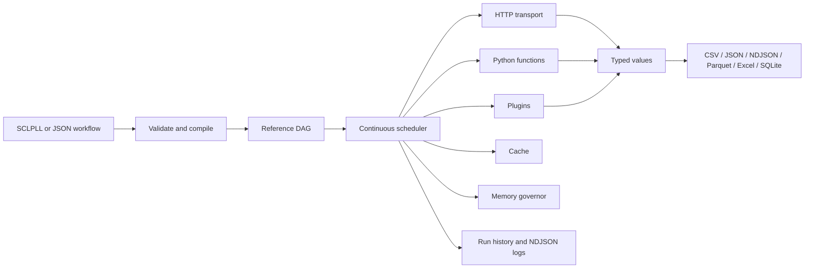

<div align="center">

<h1>sclpl</h1>

<p><strong>Programmable API workflows, written as files and run locally.</strong></p>

<p>
  Fetch pages, validate data, transform records, join local sources,<br />
  and export clean files without building a one-off Python script for every API job.
</p>

<br />

<p>
  <a href="https://github.com/sm408/sclpl-api/actions/workflows/ci.yml">
    
  </a>
  
  
  
</p>

<br />

<p>
  
  
  
  
  
  
</p>

<br />

<p>
  <code>HTTP APIs</code> ·
  <code>SCLPLL workflows</code> ·
  <code>Python functions</code> ·
  <code>SQLite history</code> ·
  <code>Plugin API</code>
</p>

</div>

---

`sclpl` reads a workflow, infers the dependency graph from `@references`, runs each step
as soon as its inputs are ready, and writes CSV, JSON, NDJSON, Parquet, Excel, or SQLite
outputs.

No server. No accounts. No web UI. Just workflows, Python values, and files you own.

---

## Why It Exists

Most API jobs start as one request and end as a brittle script. `sclpl` gives that middle
ground a shape: fetch pages, validate responses, join local data, transform records, keep
history, and export results without turning every workflow into a custom Python program.

| You need to... | `sclpl` gives you... |
|---|---|
| Pull every page from an API | Cursor, token, page, offset, and `Link:` pagination |
| Chain dependent requests | A graph inferred from `@step` references |
| Keep scripts pipeable | Response bodies on stdout, progress on stderr |
| Validate data, not just HTTP | Assertions with distinct exit codes |
| Work with tabular results | Flattening, joins, grouping, CSV, Excel, Parquet |
| Run safely at scale | Retries, cache, memory spilling, lane assignment |
| Extend the tool | Ordinary Python scripts, typed functions, and plugins through `sclpl.ext.api` |

## Showcase

<table>
  <tr>
    <td><strong>⚡ Continuous Scheduler</strong><br />Steps start the moment their references are ready. Independent API calls run together without a hand-maintained dependency list.</td>
    <td><strong>📄 Workflow Files</strong><br />SCLPLL is compact enough to write by hand, while JSON stays available for generated workflows and tooling.</td>
  </tr>
  <tr>
    <td><strong>📊 Data Workbench</strong><br />Flatten nested JSON, keep typed Python values, join records, profile tables, and export to analyst-friendly formats.</td>
    <td><strong>🧩 Plugin System</strong><br />Bundled SQLite, filesystem, example, and text plugins use the same public API that external plugins use.</td>
  </tr>
  <tr>
    <td><strong>🔐 Secrets That Refuse</strong><br />Credentials go to the OS keyring or an encrypted file. If neither safe backend exists, storage fails loudly.</td>
    <td><strong>🧠 Operational Memory</strong><br />Runs keep local history, NDJSON logs, cache state, and diffs so overnight jobs are inspectable after the fact.</td>
  </tr>
</table>

## Architecture At A Glance



## Install

```bash
pip install sclpl
```

Install extras for the parts you use:

| Extra | Adds |
|---|---|
| `sclpl[data]` | pandas-backed tables, Excel, Parquet |
| `sclpl[keyring]` | OS-keyring secret storage |
| `sclpl[crypto]` | encrypted-file secret storage for servers without keyrings |

Check the local environment:

```bash
sclpl doctor
```

## Ten-Minute Path

### 1. Send One Request

```bash
sclpl call GET https://api.example.com/orders | head
```

The body goes to **stdout** and progress goes to **stderr**, so `sclpl call` behaves like
a normal shell tool.

### 2. Turn It Into A Workflow

Create `orders.sclpll`:

```sclpll
@workflow orders "Every order, as a CSV"

@var base = "https://api.example.com"

@output report:csv

@step fetch
  get {{base}}/orders
  paginate cursor cursor_path=next_cursor param=cursor max_pages=40

@step write -> report
  save_csv @fetch.body
```

Validate without touching the network or filesystem:

```bash
sclpl validate orders.sclpll
```

Run it:

```bash
sclpl run orders.sclpll out.csv
```

`paginate` follows the source to its end and keeps the merged result in the same shape a
single page had. `save_csv` flattens nested objects into underscore columns and reaches
through a `{"data": [...]}` envelope without extra configuration.

### 3. Add A Data Check

```sclpll
@step checked
  assert_rowcount @fetch.body.data min=1
```

An assertion failure exits **4**, not 1. Automation can tell "the API failed" apart from
"the data was wrong."

## Command Surface

| Area | Commands |
|---|---|
| Workflows | `sclpl run`, `validate`, `explain`, `fmt`, `convert` |
| Python scripts | `sclpl python NAME [ARGS...]`; registered `python` workflow steps |
| One request | `sclpl call` |
| Catalogue | `sclpl import`, `list`, `show`, `remove` |
| History | `sclpl runs list`, `show`, `search`, `diff`, `replay`, `export`, `pin`, `prune` |
| Secrets | `sclpl secret set`, `get`, `list`, `remove` |
| Plugins | `sclpl plugin list`, `describe`, `scaffold`, `install` |
| Admin | `sclpl doctor`, `completion`, `docs build` |

Nothing is stubbed: if `--help` lists a command, that command works.

## What Feels Different

**Dependencies are references.** Writing `@orders` in a step is what makes that step wait
for `orders`. There is no separate `needs:` list to maintain.

**Values keep their Python types.** A number stays a number, a table stays a table, and
stringification only happens inside `{{...}}` templates.

**The scheduler is continuous.** A ready step starts when its dependencies land, not when
some previous batch has finished.

**Large runs degrade deliberately.** When memory pressure rises, intermediates spill to
disk and concurrency is reduced before the operating system gets involved.

**Plugins use the public API.** Bundled `sqlite`, `fs`, `example`, and `text` plugins are
implemented through the same `sclpl.ext.api` surface external plugins use.

## Examples

Every workflow in [`examples/`](examples/) is validated by CI.

```bash
sclpl validate examples/orders.sclpll
sclpl validate examples/12-text-plugin-library.sclpll
sclpl run examples/playbook-01.sclpll out.csv --var base=https://api.example.com
```

Start with:

| Example | Shows |
|---|---|
| [`examples/orders.sclpll`](examples/orders.sclpll) | Modes, pagination, joins, reports |
| [`examples/playbook-01.sclpll`](examples/playbook-01.sclpll) | Paginated API to CSV |
| [`examples/playbook-02.sclpll`](examples/playbook-02.sclpll) | API rows joined with SQLite |
| [`examples/12-text-plugin-library.sclpll`](examples/12-text-plugin-library.sclpll) | Bundled text plugin helpers |

## Extending

Use an ordinary local or provider-backed script when you need one project-specific step, without
creating a plugin package. Register an alias and pin the exact bytes first:

```toml
[python.scripts.report]
path = "scripts/report.py" # or uri = "azblob://account/container/report.py"
sha256 = "<lowercase SHA-256 of the script bytes>"
```

Then run only the registered name: `sclpl python report --month 2026-09`. The script uses the
same Python environment as `sclpl`, so it can `import sclpl` when useful.
To place it in a workflow, call the built-in `python` function. `input=` is sent as JSON on
standard input; JSON written to standard output becomes the next step's value:

```sclpll
@step scored
  python "report" args=["--model", "v2"] input=@fetch.body
```

See the [Python script example](examples/13-python-script.sclpll) and the
[workflow guide](docs/guide/workflow-anatomy.md#ordinary-python-scripts) for the complete
contract. SCLPL refuses paths, URIs, dynamic names, and changed bytes; registered scripts are
still trusted code, not a sandbox. Use a plugin when the integration needs reusable distribution,
discovery, or declared capabilities.

Scaffold a plugin:

```bash
sclpl plugin scaffold mything
```

The generated plugin loads and runs immediately. Import from `sclpl.ext.api` and nothing
else; that module is the compatibility promise.

Add a built-in-style Python function with the function registry:

```python
from sclpl.ext.functions import function


@function("domain", builtin=False)
def domain(url: str) -> str:
    return url.split("//", 1)[-1].split("/", 1)[0]
```

## Documentation

| Path | Use it for |
|---|---|
| [`docs/playbooks/`](docs/playbooks/) | Worked tasks you can adapt |
| [`docs/guide/`](docs/guide/) | Workflow anatomy, SCLPLL syntax, and glossary |
| [`docs/concepts.md`](docs/concepts.md) | The vocabulary in dependency order |
| [`docs/reference/`](docs/reference/) | Generated command, function, expression, and plugin reference |
| [`docs/vault/`](docs/vault/) | Obsidian notes explaining why the system is shaped this way |
| [`docs/cli-rebuild/SPEC.md`](docs/cli-rebuild/SPEC.md) | Normative design spec; wins any disagreement |
| [`docs/limitations.md`](docs/limitations.md) | Deliberate follow-up areas and current boundaries |

Good next reads:

1. [`Paginated API to CSV`](docs/playbooks/01-paginated-api-to-csv.md)
2. [`Joining Sources`](docs/playbooks/02-joining-sources.md)
3. [`Concepts`](docs/concepts.md)
4. [`Functions Reference`](docs/reference/functions.md)

Current boundaries are documented in [`docs/limitations.md`](docs/limitations.md).

Choose a path by role: [Analyst](docs/playbooks/05-analyst.md), [Data Engineer](docs/playbooks/06-data-engineer.md),
or [Software Engineer](docs/playbooks/07-software-engineer.md).

## Developing

```bash
pip install -e ".[dev,data,crypto]"
python -m ruff check
python -m ruff format --check
python -m mypy
python -m pytest -q
python scripts/check_budget.py
python scripts/check_layering.py
python scripts/check_vault.py
sclpl docs build --check
```

Before a commit, the required gates are lint, format, strict mypy, tests, line budget,
layering, vault links, and generated-doc drift.

## License

MIT. See [`LICENSE`](LICENSE).
