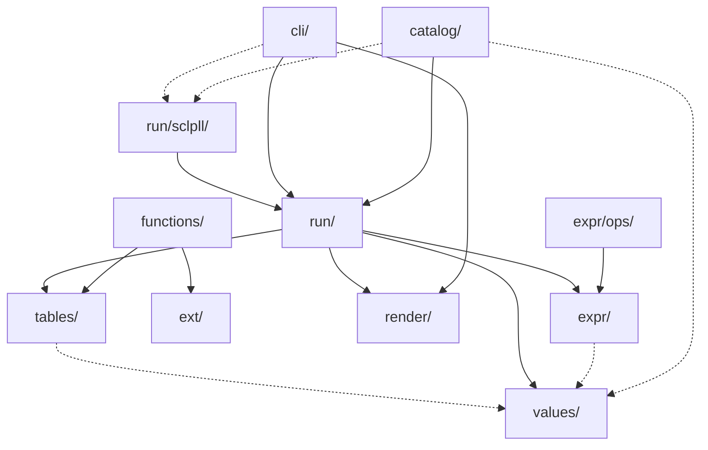

---
tags:
  - architecture
---

# Architecture Measured

[[Architecture Overview]] says what the shape is meant to be. This note says what it
**is**, from `python scripts/check_layering.py`, which reads every import in `sclpl/`
and refuses a cycle.

A claim like "decoupled" is worth exactly as much as the thing that checks it.

## The graph



Solid is more than one file; dotted is a single import. `sclpl/` itself — `__init__` and
`bootstrap` — is left out: it is the entry point, so it names the CLI and the CLI names
it back, and drawing that would obscure the rest.

## Fan-in and fan-out

| Package | out | in |
|---|---:|---:|
| `catalog/` | 4 | 0 |
| `cli/` | 4 | 1 |
| `expr/` | 2 | 2 |
| `expr/ops/` | 2 | 0 |
| `ext/` | 1 | 1 |
| `functions/` | 3 | 0 |
| `render/` | 0 | 2 |
| `run/` | 5 | 3 |
| `run/sclpll/` | 2 | 2 |
| `tables/` | 2 | 2 |
| `values/` | 1 | 4 |

**27 edges between 12 packages. No cycles.**

`render/` depends on nothing and is depended on by two — it is a sink, which is what a
presentation layer should be. `catalog/` and `functions/` depend on things and nothing
depends on them: they are the top of the stack.

## What measuring it found

The numbers above are the *second* measurement. The first one, taken while writing these
notes, said something different and worth recording.

### `run/errors.py` had 37 importers

Every package imported it — `expr/`, `tables/`, `values/`, `ext/`, `functions/`,
`catalog/`, `cli/`. `run/`'s fan-in was **9**, and `run/` looked like a god-package that
the whole tree depended on.

It was not. What the tree depended on was one leaf: a shared vocabulary of diagnostics
that happened to live inside `run/`. It is now `sclpl/errors.py`, and `run/`'s fan-in is
3.

### The exit codes were in the wrong place

`run/errors.py` imported `EXIT_*` from `cli/options.py` — the engine reaching into the
command line for the numbers it exits with. That was a genuine `cli ↔ run` cycle.

An exit code is a property of a *kind of failure*, not of the surface that reports it.
They moved to `sclpl/errors.py` alongside the errors that carry them.

### `BY_EXTENSION` was in the wrong place

`run/ports.py` held the extension-to-format map, and `tables/io.py` imported it — path
binding owning a fact about formats, with the format module as its consumer. That was a
`run ↔ tables` cycle.

It moved, with `STDIO` and the `Format` alias, to `tables/io.py`. `run/ports.py` is now
one of its readers, which is what it always was.

## Why the note graph does not look like this

The Obsidian graph is a picture of how these *notes* link, not of how the code depends.
They are different graphs and should be. See [[Graph View]].

## Keeping it true

```bash
python scripts/check_layering.py           # fails on a cycle
python scripts/check_layering.py --graph   # the Mermaid above
```

The diagram in this note is pasted from that command. When it changes, paste it again —
a hand-drawn architecture diagram is a drawing of an intention.

→ [[Maintaining This Vault]], [[Decision Log]]
