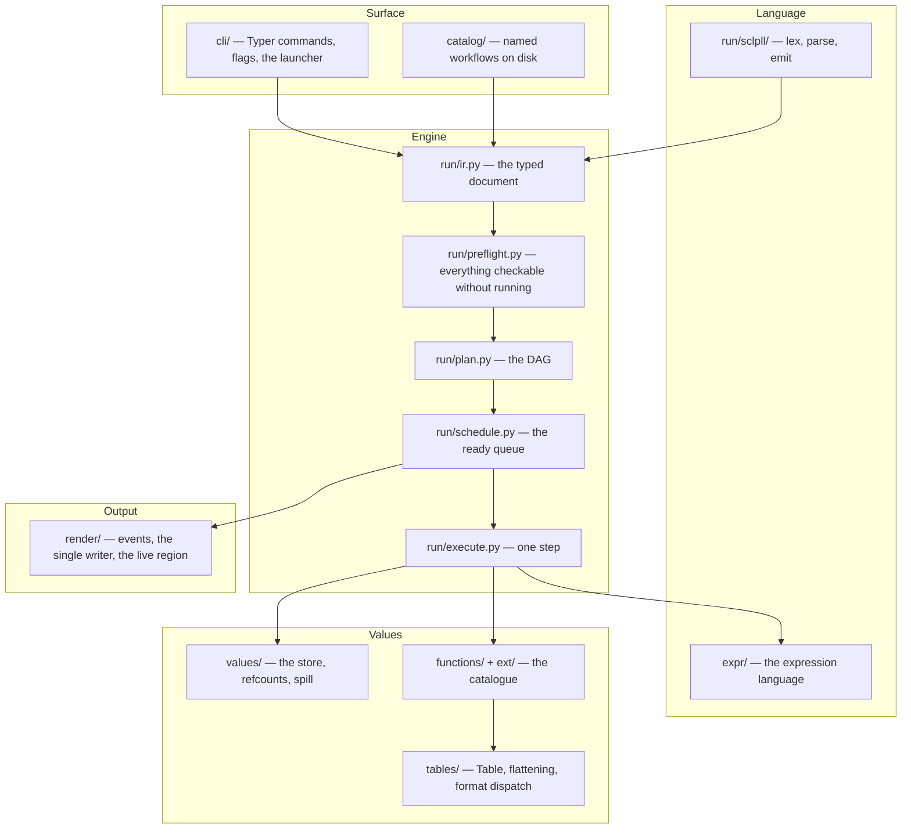

---
tags:
  - architecture
---

# Architecture Overview

One binary, one engine, one dependency graph. Everything below happens in a single
process; nothing is a service.

## The five moving parts

**[[The IR]]** (`run/ir.py`) is a pydantic model with `extra="forbid"`. It is the only
representation of a workflow. Both surfaces — JSON and [[SCLPLL Reference|SCLPLL]] —
parse *into* it and emit *from* it, which is what makes them provably equivalent rather
than approximately equivalent.

**[[The DAG]]** (`run/plan.py`, `run/compile_plan.py`) is inferred, never declared. A
step that reads `@orders` depends on `orders` because it says `@orders`. See
[[Invariants#3 The DAG is inferred from references]].

**[[The Scheduler]]** (`run/schedule.py`) is a ready queue with ordered semaphores, not
barrier waves. A node is admitted the moment its last dependency lands.

**[[The Value Store]]** (`values/store.py`) holds step outputs with refcounts. Values
keep their Python types the whole way; stringification happens only at an interpolation
boundary.

**[[The Terminal Layer]]** (`render/`) is hand-written — `rich` is not a dependency, see
[[Locked Decisions#7 The terminal layer is hand-written]]. Every component emits events
to one queue and exactly one task holds the stderr handle.

## What is deliberately absent

- No plugin sandbox. Plugins are trusted code, gated by declared capabilities.
- No abstraction with one implementation. See [[Invariants#8 No abstraction until the second caller]].
- No config service, no dependency-injection container, no `contracts/` package.

## Is it actually like this?

The diagram above is the intention. [[Architecture Measured]] is the same graph read out
of the imports by `scripts/check_layering.py`, which refuses a cycle. Writing it found
three edges pointing the wrong way, all now fixed.

## Where to go next

[[Package Map]] for the file-by-file tour, [[The Pipeline]] for the runtime sequence.
