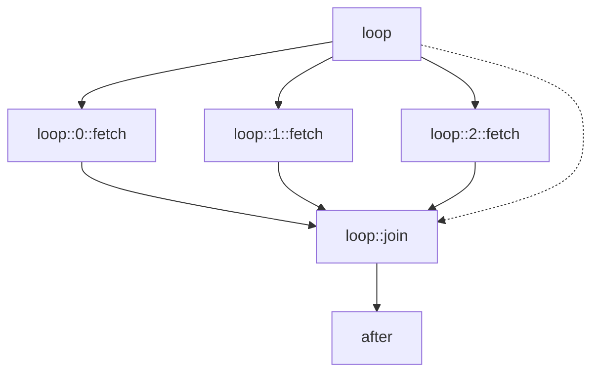
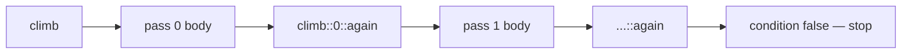

---
tags:
  - concept
---

# Control Flow

`run/control.py` decides; `run/schedule.py:expand` wires. No control-flow kind does its
own work — each answers a question and hands the scheduler the nodes that answer implies.

## Why injection, not `gather`

[[Invariants#3 The DAG is inferred from references]] and SPEC §12 meet here.

A `gather` inside a step holds a worker and a semaphore slot while its children run. A
hundred-element loop against a host limited to four then either deadlocks or quietly
exceeds the limit it was given. Nodes in the graph are admitted by the same gate as
everything else, so a loop is simply a hundred more steps and **every ceiling still
means what it says**.



`after` used to wait for `loop`; `expand` moved that edge to the barrier. Same indegree,
later edge, nothing downstream observes the loop half-built.

## Names and scope

A body step written once becomes many nodes, so each gets a decorated id —
`loop::3::fetch`. The decoration is scheduling bookkeeping and **never appears in an
expression**: inside the body, `@fetch` means this iteration's `fetch`, because each
iteration carries a `Frame` and a frame is part of the lookup chain.

`::` cannot appear in a step id, so an injected name can never collide with one someone
wrote.

## What each kind produces

| Kind | Copies made | Value |
|---|---|---|
| `foreach` | one per element | list, in element order |
| `parallel` | one per branch | list, in branch order |
| `if` | one, of the taken branch | that branch's last step's value |
| `while` / `do_while` | one per pass, chained | the **last** pass's value |
| `gate` | none | its reason string |

A loop that runs until something is true is asking for the state at the end; the
intermediate states are what it was getting past. That is why `while` keeps only the
last.

Ordering is the order the copies were **made**, never the order they finished. A loop
whose results came back shuffled would be a loop nobody could use.

## Within a body

A body is a sequence: each step waits for the one before it. The reference scan cannot
see that — two steps that share no names still have an order, and it is the one they
were written in. Between copies there is no such edge: iteration 3 never waits for
iteration 2.

## `while` and its continuation

Each pass injects its body **and** a continuation node that re-evaluates the condition.
The continuation expands in turn, so the chain grows exactly as far as the condition
allows and no worker is held waiting for it. Because `expand` hands a node's dependents
to the barrier it creates, the first pass's barrier inherits the whole chain.



The continuation runs in the pass's own frame, so the next condition sees what the pass
just did. That is the only way the condition can go false, and therefore the only way
the loop can end on its own terms.

**Before the first pass**, the body's own names are bound to `null` rather than left
unresolved — a loop body commonly refers to what the previous pass produced, and on pass
zero there is none. The alternative is an error naming a step written two lines below.
A name the body does *not* produce is still unresolved, so a typo stays a typo.

`do_while` differs in exactly one place: the first pass is unconditional. That is the
right shape for "fetch, then decide whether to fetch again".

`max_iterations` defaults to 1000 and its error says both remedies: raise it, or check
that the condition actually goes false.

## Bounding a fan-out

`concurrency` on a `foreach` caps how many copies run at once:

```
@step details
  foreach @ids as row
    concurrency 4
    step one
      get {{base}}/items/{{row.id}}
```

It is implemented as a **per-tag ceiling with a private name** (`::loop:details`), so it
goes through the same ordered acquisition as every other limit and cannot introduce a new
way to deadlock. A fourth kind of semaphore would have to argue that separately.

It is a literal, not a template: the limit is read when the file is parsed, before there
is anything to interpolate.

> [!note] It is measured, not asserted
> Against a server reporting its peak simultaneous requests, 12 items at `concurrency 3`
> peaked at 3. The same workflow without the clause peaked at 9. Global and host ceilings
> were 16 in both.

## Choosing what an iteration contributes

`collect` is an expression evaluated in the iteration's scope after its body has run:

```
    collect @one.body.id
```

Without it, an iteration contributes its last step's value — usually a whole response
when what was wanted was one field out of it.

## Empty cases

- `foreach` over `[]` → `[]`. The loop ran, over nothing. A workflow that filtered
  everything out should carry on, not fail in a way that reads like the API broke.
- `when` with no `otherwise`, condition false → `null`, so a downstream reference still
  resolves.
- `foreach` or `while` with no body at all → an error. That is a typo, not a case.

## Looping over an object

`foreach @obj` yields `{"key": k, "value": v}` per entry. Treating an object as one
element would be a loop that runs once and looks like it worked.
