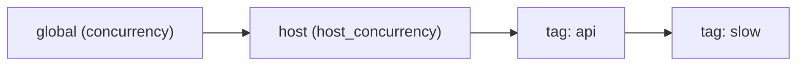

---
tags:
  - concept
---

# The Scheduler

`run/schedule.py`. A ready queue, not barrier waves — [[Why a Rewrite|defect 2]].

## The loop

```
while ready:
    node = pop highest remaining-critical-path
    async with gate.hold(node):
        value = await runner(node)
    store.put(node.publishes, value, readers=plan.readers_of(...))
    for name in node.reads: store.release(name)
    for dep in node.dependents:
        if --indegree[dep] == 0: push(dep)
```

A node is admitted the moment its last dependency lands. The predecessor waited for
every step in a wave to finish before starting the next, so one slow request held back
everything behind it whether or not anything depended on it.

Workers `await` on an `asyncio.Event` rather than spinning: a worker with nothing to do
sleeps until another finishes and either pushes work or empties the graph.

## Ordered semaphores

`_Gate.hold` acquires in a **fixed global order**: the process-wide ceiling, then the
host, then each tag in sorted order. Releasing happens in reverse.

That is the whole deadlock argument. Two workers can never hold the pair a third needs
in the opposite order, because there is no second order for a cycle to form in.



## Runtime expansion

`Scheduler.expand(parent, specs)` grows the graph beneath a running node. Given a parent
P with dependents D and new nodes N₁..Nₙ:

- each Nᵢ waits for P, so it starts as soon as P produces the collection
- a barrier `P::join` waits for P and every Nᵢ
- every D now waits for the barrier instead of for P — same indegree, later edge

P then settles normally. Nothing downstream can observe the loop half-finished, and
nothing had to block a worker to arrange it.

This is why `foreach` obeys the global ceiling: twenty iterations against a host limited
to four take four at a time, exactly as twenty separate steps would. A `gather` inside a
step would hold a worker and a semaphore slot while its children ran.

→ [[Control Flow]]

## Cancellation

Ctrl-C is subtle and was got wrong once. The `TaskGroup` raises an `ExceptionGroup`;
catching `except* asyncio.CancelledError` and returning an `Outcome` makes `asyncio.run`
believe the run finished, so Ctrl-C appears to do nothing.

The fix is to re-raise a bare `asyncio.CancelledError` **outside** the `except*` block —
a bare `raise` *inside* re-wraps it in a group — gated on whether this task was the one
cancelled.

## Failure

One step failing does not kill the run's bookkeeping. The failure is recorded, a
`StepFinished(status="failed")` is emitted, and unless `--keep-going` is set the
scheduler stops admitting new work. Everything that never ran is reported as skipped,
which is different from "not mentioned".
