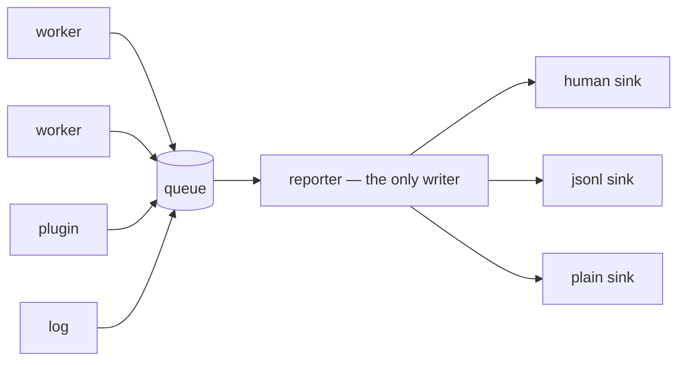

---
tags:
  - concept
---

# The Terminal Layer

`render/`. Hand-written; `rich` is not a dependency —
[[Locked Decisions#7 The terminal layer is hand-written]].

## One writer

[[Invariants#4 One writer to the terminal]]. Every worker, plugin, and log record emits
an **event** to a single queue; exactly one task holds the stderr handle.

This is what keeps a live region intact while a worker pool writes underneath it.

## Redaction lives here

[[Invariants#9 Secrets never reach a log, a label, or a trace]]. `render/redact.py`
redacts in the reporter, keyed on the set of resolved secret values — so a component
that forgets to redact cannot leak, because it never had the chance.

## The ladder

`full` → `simple` → `plain`, and **only downward**
([[Invariants#5 The render ladder only descends]]).

`Caps.descend()` drops one rung. A sink that raises causes a descent. A terminal that
failed once is not trusted again: climbing back would produce a display that flickers
between modes, which is worse than the lower mode.

`SCLPL_RENDER=plain` pins it, and `--plain` does the same.

## Capability probing

Probed once at startup, never re-probed:

- **colour** — `NO_COLOR` unset, and `TERM` is not `dumb`; `COLORTERM` forces yes
- **unicode** — the glyph table is encoded against the stream's encoding; if it fails,
  every glyph falls back to its ASCII column
- **size** — `os.get_terminal_size()`, with a default when there is no terminal
- **Windows VT** — `ENABLE_VIRTUAL_TERMINAL_PROCESSING` is turned on; failure means
  plain

Glyphs come in pairs, fancy and ASCII: `✔/+`, `✘/x`, `–/-`, `→/->`, `•/*`, and a braille
spinner falling back to `|/-\`.

## The live region

`render/live.py`. A DECSTBM scroll region so completed lines scroll normally while the
progress block stays put.

Two bugs worth remembering, both from M3:

- **Truncation happened at paint time**, so a caller that composed a row got an untruncated
  one. It moved into `_compose`, where every caller gets no-wrap rows.
- **A long workflow name pushed the progress bar off the line.** The name is now elided to
  `width // 3`.

The bar uses sub-cell block characters when Unicode is available and `[###---]` when it
is not.

## Verbosity

`-q` errors and summary only, `-qq` silence. `-v` more detail, up to `-vvv` (every
admission decision). `--json` emits NDJSON events on stderr and suppresses the human
view — which is the machine-readable interface, on stderr, because
[[Invariants#1 stdout is data, stderr is interface|stdout is data]].
