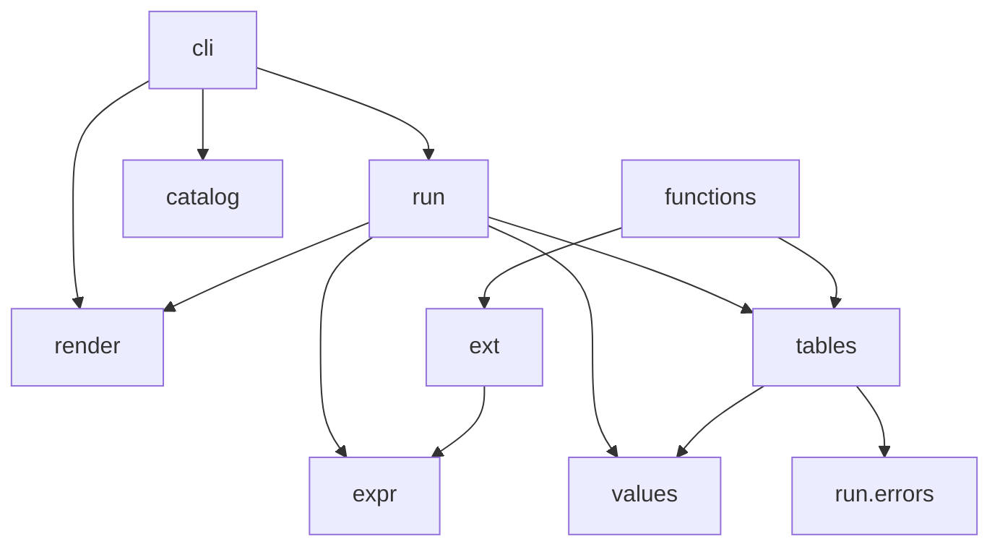

# Package Map

`sclpl/`, package by package, with the [[The Line Budget|budget]] each is held to.

| Package | Budget | What it is |
|---|---:|---|
| [[cli]] | 1,400 | Typer commands, global flags, the bare launcher |
| [[render]] | 1,300 | Events, the single writer, the live region, sinks |
| [[catalog]] | 500 | Named workflows on disk, name resolution |
| [[run]] | 3,600 | The engine: IR, preflight, plan, schedule, execute |
| [[run-sclpll]] | 1,200 | The SCLPLL surface: lex, parse, emit |
| [[values]] | 1,000 | The store, refcounts, spill, digests, cache |
| [[expr]] | 1,500 | Lexer, parser, AST, evaluator, dispatch table |
| [[expr-ops]] | 1,400 | The operator catalogue |
| [[tables]] | 900 | `Table`, backends, flattening, format dispatch |
| [[ext]] | 700 | The `@function` registry, the plugin ABI |
| [[functions]] | 1,200 | The 37 built-ins |
| [[state]] | 900 | Run history, settings, secrets #todo *(M9)* |
| [[plugins_bundled]] | 600 | `sqlite`, `fs`, `example` #todo *(M8)* |

## `run/` in detail

| File | Job |
|---|---|
| `ir.py` | The typed document. Both surfaces meet here |
| `compile_json.py` | JSON surface ↔ IR |
| `sclpll/lex.py` | Tokens, indentation, argument splitting |
| `sclpll/parse.py` | Tokens → IR |
| `sclpll/emit.py` | IR → canonical SCLPLL |
| `compile_plan.py` | Reference scanning → plan specs |
| `plan.py` | The DAG: build, cycle detection, critical paths |
| `modes.py` | Mode resolution, pruning, the closure check |
| `ports.py` | Declaration and binding |
| `preflight.py` | Everything checkable without running |
| `schedule.py` | The ready queue, the gate, runtime expansion |
| `execute.py` | One step, dispatched on kind |
| `control.py` | `foreach` / `if` / `while` / `parallel` → nodes |
| `paginate.py` | The five strategies |
| `transport.py` | Pooled clients, breakers, adaptive limits |
| `retry.py` | Backoff, jitter, `Retry-After` |
| `runner.py` | The assembly: preflight → plan → schedule → report |
| `errors.py` | Typed diagnostics |

`runner.py` is deliberately the only assembly point, so `run`, the launcher, and (later)
`runs replay` behave identically — they differ in how they gather arguments, not in what
happens afterwards.

## The dependency direction

`values/` must not import `tables/`. It needs to read a spilled Parquet file, and does
it through a **reader registry**: `tables/__init__.py` calls
`values.ref.register_reader("parquet", …)` at import. The dependency points the right
way and the capability still exists.
