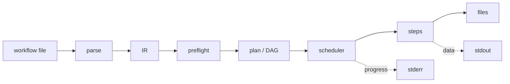

# Start Here

`sclpl` is a **command-line pipeline runner for HTTP APIs**. It reads a workflow, works
out what depends on what, runs it as fast as the remote allows, and writes the result as
CSV, JSON, NDJSON, Parquet, Excel, or SQLite.

```
sclpl run orders.sclpll --var base=https://api.example.com in.csv out.csv
```

There is no TUI, no web UI, no server, and no daemon. See [[Locked Decisions]] for why
that is a decision rather than an omission.

## Read in this order

1. [[Why a Rewrite]] — the four defects that made a port impossible
2. [[Architecture Overview]] — the shape of the whole thing in one page
3. [[Invariants]] — ten rules; breaking one is a review block
4. [[The Pipeline]] — what happens between typing a command and getting a file

## Then, by what you are doing

| I want to… | Start at |
|---|---|
| Write a workflow | [[Writing a Workflow]], then [[SCLPLL Reference]] |
| Understand an error | [[Errors and Exit Codes]] |
| Add a function | [[Extending sclpl]] |
| Change the engine | [[Package Map]], then the package's own note |
| Know why something is the way it is | [[Decision Log]] |
| Know what is done and what is not | [[Milestone Status]] |

## Maps of content

- [[Architecture Overview]] · [[Package Map]] · [[The Pipeline]] · [[Data Flow]]
- [[Invariants]] · [[Locked Decisions]] · [[Decision Log]]
- [[Concepts Index]] — every idea with a name
- [[Milestone Status]] — M0 through M9
- [[Journal]] — what happened, session by session
- [[Maintaining This Vault]] — how this stays true

## The shape of it



`stdout` and `stderr` are separate on purpose. See [[Invariants#1 stdout is data, stderr is interface]].
