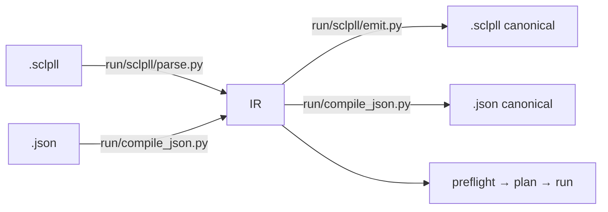

# The IR

`run/ir.py`. A pydantic v2 model tree with `extra="forbid"` throughout. It is the **only**
representation of a workflow; everything else parses into it or emits from it.

## Why one representation

Two surfaces exist — JSON and [[SCLPLL Reference|SCLPLL]] — and they must be equivalent,
not approximately equivalent. Making both go through one model means the equivalence is
structural rather than maintained by hand. `tests/unit/test_ir.py` asserts the round
trip in both directions.

`extra="forbid"` matters more than it looks: a typo'd field is a validation error naming
the field, not a silently ignored key that makes a workflow do nothing.



## The document

`WorkflowDoc` holds `name`, `version`, `description`, `default_mode`, `vars`, `rules`,
`inputs`, `outputs`, `modes`, `limits`, and `steps`.

- `vars` — workflow-level variables, the outermost expression scope
- `rules` — named expressions, referred to by `assert` / `skip_if` / `retry_if`
- `inputs` / `outputs` — [[Modes and Ports|ports]]
- `limits` — concurrency ceilings, timeout, memory budget, per-tag caps

Two helpers do a lot of work: `all_steps()` walks nested bodies depth-first, and
`children()` returns a step's body for the kinds that have one.

## A step

```python
class Step:
    id: str
    kind: StepKind      # http fn use let foreach if while do_while gate parallel
    config: StepConfig  # the matching config model
    needs: list[str]    # may add an edge, never remove one
    assert_ / skip_if / retry_if: str | None
    retry: Retry
    cache: CacheSpec
    lane: Lane | None   # inferred when null
    keep: bool          # exempt from disposal
    writes: str | None  # the output port this step fills
```

`kind` sits **outside** `config` because it reads better in both surfaces; a
`model_validator(mode="before")` builds the right config model from it.

`writes` is the `@step name -> port` form. See [[Modes and Ports#Writing to a port]].

## The configs

| Kind | Config | Notable fields |
|---|---|---|
| `http` | `HttpConfig` | `method`, `url`, `headers`, `query`, `body`, `paginate`, `extract` |
| `fn` | `FnConfig` | `name`, `args`, `kwargs` |
| `let` | `LetConfig` | `expr` or `value` |
| `foreach` | `ForeachConfig` | `over`, `var`, `body`, `concurrency`, `collect` |
| `if` | `IfConfig` | `condition`, `then`, `otherwise` |
| `while` / `do_while` | `WhileConfig` | `condition`, `body`, `max_iterations` |
| `parallel` | `ParallelConfig` | `branches` |
| `gate` | `GateConfig` | `reason` |
| `use` | `UseConfig` | `workflow`, `mode`, `inputs` #todo *(M8)* |

→ [[Step Kinds]] for what each one does at runtime.
