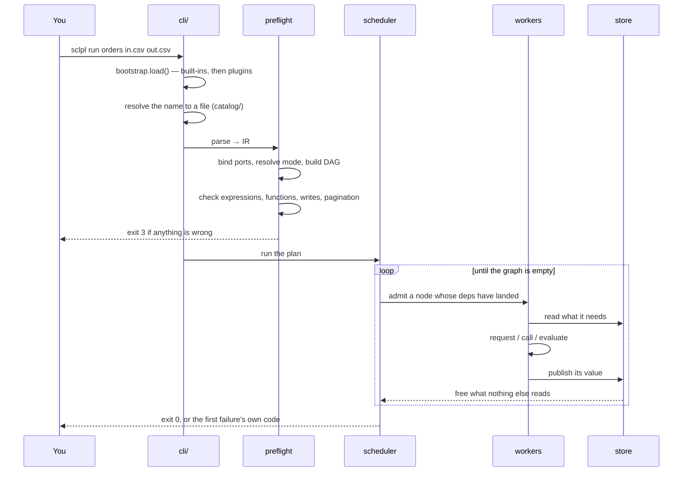

# The Pipeline

What happens between typing a command and getting a file. Every arrow is a place a run
can stop with a specific exit code — see [[Errors and Exit Codes]].

## 1. Resolve

`cli/launcher.py` and `catalog/resolve.py` turn `orders` into a path. A bare name is
looked up in the catalogue; a path is used as-is. Misspellings get a suggestion, not a
"file not found".

## 2. Parse

The extension chooses the surface. `.sclpll` goes to `run/sclpll/parse.py`; `.json` to
`run/compile_json.py`. Both produce the same [[The IR|IR]].

## 3. Preflight

`run/preflight.py`. **No network and no writes** — that constraint is what makes it safe
to run automatically, and what makes a green preflight mean something. In order:

1. Ports bind ([[Modes and Ports]])
2. The mode resolves and the graph stays closed
3. References resolve and there are no cycles
4. Expressions parse
5. Functions exist, `-> port` names a real port, paginators have what they need
6. Inputs are readable and output directories exist
7. Optional extras are reported (`pip install sclpl[data]`), never discovered mid-run

## 4. Plan

`run/compile_plan.py` scans every string for `@name`, unions that with declared `needs`,
and hands `run/plan.py` a set of specs. `build()` detects cycles and scores critical
paths so the longest chain starts first.

Nested control-flow bodies are **not** nodes at this stage. See [[Control Flow]].

## 5. Schedule

`run/schedule.py`. Workers pull from a priority queue ordered by remaining critical
path. Each acquires semaphores in a fixed global order — global, then host, then tags
sorted — which is the whole deadlock argument.

## 6. Execute

`run/execute.py` dispatches on the step's config type. See [[Step Kinds]].

## 7. Report

Every component emits events; `render/reporter.py` fans them out to sinks. See
[[The Terminal Layer]].
